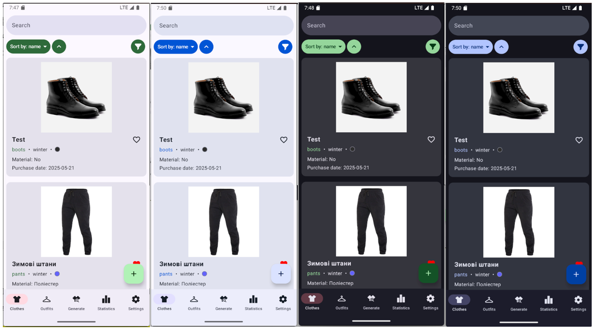
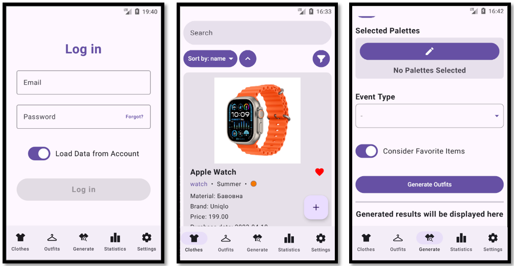

# ClothesAdvisor (for Android)

## Table of Contents

- [About](#about)
- [Features](#features)
- [Technologies Used](#technologies-used)
- [Usage](#usage)
- [License](#license)
- [Server Application](https://github.com/NureZamkovyiAnatolii/clothes-advisor-server)

## About

**ClothesAdvisor** the app is an Android application for wardrobe management. The main functionality allows users to catalog clothes, create outfits and receive personalized recommendations that are auto-generated by the special algorithm on the [server](https://github.com/NureZamkovyiAnatolii/clothes-advisor-server).

One of the main advantages of the mobile app itself is that the most of the functions are enabled offline (for guests too and does not require Internet connection).

## Features

### Functionality

- User authorization and registration:
    - enter as a guest (the data will be stored locally);
    - registration by email address which allows to save the data in the account;
    - authorization with the ability to synchronize the data between a mobile device and the server, where the user will have to choose if he/she wants to load the account data into the device or load the current device data to the account;
    - resetting the user's password.
- Wardrobe management:
    - adding clothing items which includes selecting an image of the item and the text data:
        - name;
        - material;
        - category (headwear, outerwear, shoes, etc.);
        - season (winter, spring, summer, autumn);
        - main color (RGB format);
        - additional parameters: brand, date of purchase, cost, is favorite (optional).
    - editing the clothing item characteristics;
    - deleting clothing items;
    - the ability to remove the background of the images of clothing item;
    - the ability to mark favorite clothing items to improve the result of auto-generating clothing outfits.
- Outfit generating or self-making:
    - automatic generation of outfits based on the parameters:
        - the location of the device or the selected location on the map;
        - the date and the time when you are going to use the recommended outfit;
        - the main color for the outfit recommendations (works better when using with the selected palettes);
        - the color palettes list;
        - the event type that describes the purpose of the outfit in more detail;
        - the parameter that tells if the algorithm has to consider the items that are marked as "Favorite".
    - manual outfit making with the ability to select the wardrobe elements;
    - editing saved outfits;
    - deleting saved outfits.
- Statistics:
    - statistics on the number of the clothing items (total, for each season, for each category);
    - statistics on the age of the clothing items (top 5 items from the oldest to the newest);
    - statistics on the use of clothes in outfits (top 10 items);
    - percentage ratio of the favorite and unfavorite clothing items.
- Personal settings:
    - change the interface language (English and Ukrainian are available);
    - change the user's email;
    - change the user's password.

### Internet connection is required for

- registration and authorization;
- password resetting;
- the ability to use the functionality as an authorized user;
- editing user credentials (email address, password);
- the ability to remove the background of images of the clothing items;
- outfit auto-generation.

### Dynamic UI theme

The UI of the app uses the specific feature for Android apps which is dynamic colors for key interface elements. Buttons, icons, and the other elements automatically take on shades that match the color scheme of the user's device.

However, this feature only works for Android 12+ version. The older versions use the static (unchangeable) colors.

## Technologies Used

- OS: [Android 7+](https://www.android.com/);
- IDE: [Android Studio](https://developer.android.com/studio);
- UI Framework: [Jetpack Compose](https://developer.android.com/compose);
- Local DB: [SQLite](https://sqlite.org/index.html);
- ORM for Local DB: [Room Database](https://developer.android.com/training/data-storage/room);
- Main Language: [Kotlin](https://kotlinlang.org/).

## Usage

Install the app using the APK file from the Github Releases or clone the project and create the APK yourself using the build function in [Android Studio](https://developer.android.com/studio) IDE.

You can change the `BASE_URL` variable in [HttpServiceManager.kt](./app/src/main/java/com/olehmaliuta/clothesadvisor/data/http) (/app/src/main/java/com/olehmaliuta/clothesadvisor/data/http) to set new server base URL.

## License

[MIT License](LICENSE)

## [Server Application](https://github.com/NureZamkovyiAnatolii/clothes-advisor-server)
